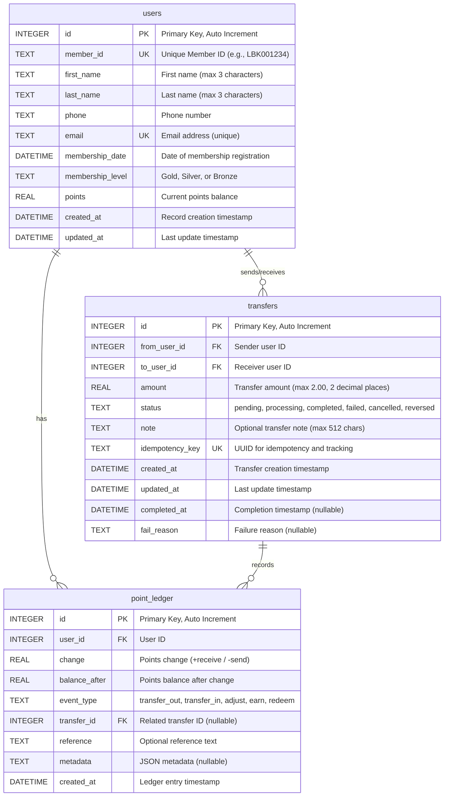

# Database Documentation - KBTG Backend API

## Entity Relationship Diagram



## Database Schema Details

### Tables

#### 1. **users** - User Information Table
Stores user profile information and current points balance.

**Primary Key:** `id`

**Unique Constraints:**
- `member_id` - Unique member identifier
- `email` - Unique email address

**Indexes:**
- None (small table, primary operations on PK)

**Business Rules:**
- `first_name` and `last_name` must not exceed 3 characters
- `membership_level` must be one of: Gold, Silver, Bronze
- `points` cannot be negative (enforced at application level)

---

#### 2. **transfers** - Transfer Transactions Table
Records all point transfer transactions between users.

**Primary Key:** `id`

**Foreign Keys:**
- `from_user_id` → `users(id)` - Sender
- `to_user_id` → `users(id)` - Receiver

**Unique Constraints:**
- `idempotency_key` - UUID for duplicate prevention

**Indexes:**
- `idx_transfers_from` on `from_user_id`
- `idx_transfers_to` on `to_user_id`
- `idx_transfers_created` on `created_at`

**Business Rules:**
- `amount` must be > 0 and <= 2.00
- `amount` must have at most 2 decimal places
- `status` must be one of: pending, processing, completed, failed, cancelled, reversed
- Cannot transfer to the same user as the last completed transfer
- System generates `idempotency_key` as UUID

**Status Flow:**
```
pending → processing → completed
              ↓
            failed
```

---

#### 3. **point_ledger** - Point Transaction Ledger (Append-Only)
Audit log of all point changes. This is an append-only table for tracking point history.

**Primary Key:** `id`

**Foreign Keys:**
- `user_id` → `users(id)` - User whose points changed
- `transfer_id` → `transfers(id)` - Related transfer (if applicable)

**Indexes:**
- `idx_ledger_user` on `user_id`
- `idx_ledger_transfer` on `transfer_id`
- `idx_ledger_created` on `created_at`

**Business Rules:**
- `event_type` must be one of: transfer_out, transfer_in, adjust, earn, redeem
- `change` can be positive (receive) or negative (send)
- `balance_after` records the point balance after this transaction
- Entries are never updated or deleted (append-only)

**Event Types:**
- `transfer_out` - Points sent to another user
- `transfer_in` - Points received from another user
- `adjust` - Manual adjustment by admin
- `earn` - Points earned from activity
- `redeem` - Points redeemed for rewards

---

## Relationships

### 1. users → transfers (One-to-Many, Both Directions)
- A user can **send** multiple transfers (`from_user_id`)
- A user can **receive** multiple transfers (`to_user_id`)
- Each transfer has exactly one sender and one receiver

### 2. users → point_ledger (One-to-Many)
- A user has multiple ledger entries tracking their point history
- Each ledger entry belongs to exactly one user

### 3. transfers → point_ledger (One-to-Many)
- A transfer creates two ledger entries:
  1. One for the sender (negative change)
  2. One for the receiver (positive change)
- Some ledger entries may not be linked to a transfer (e.g., manual adjustments)

---

## Transaction Flow

### Transfer Process (Atomic Transaction)

```
1. START TRANSACTION
2. Validate sender has sufficient points
3. Validate receiver exists
4. Create transfer record (status: completed)
5. Deduct points from sender
6. Add points to receiver
7. Create ledger entry for sender (transfer_out, negative change)
8. Create ledger entry for receiver (transfer_in, positive change)
9. COMMIT TRANSACTION
```

**Rollback Conditions:**
- Insufficient points
- User not found
- Database constraint violation
- Any step failure

---

## Validation Rules

### User Validation
1. ✅ First name ≤ 3 characters
2. ✅ Last name ≤ 3 characters
3. ✅ Email must be unique and valid format
4. ✅ Phone number required
5. ✅ Membership level: Gold, Silver, or Bronze
6. ✅ Points ≥ 0

### Transfer Validation
1. ✅ Amount > 0 and ≤ 2.00 points
2. ✅ Amount has at most 2 decimal places
3. ✅ Cannot transfer to self
4. ✅ Cannot transfer to same user as last transfer
5. ✅ Sender must have sufficient points
6. ✅ Both sender and receiver must exist

---

## Query Examples

### Get user with current points
```sql
SELECT * FROM users WHERE id = ?;
```

### Get user's transfer history (sent and received)
```sql
SELECT * FROM transfers 
WHERE from_user_id = ? OR to_user_id = ?
ORDER BY created_at DESC
LIMIT ? OFFSET ?;
```

### Get user's point ledger
```sql
SELECT * FROM point_ledger 
WHERE user_id = ?
ORDER BY created_at DESC;
```

### Get transfer details with sender and receiver info
```sql
SELECT 
    t.*,
    u1.first_name as sender_first_name,
    u1.last_name as sender_last_name,
    u2.first_name as receiver_first_name,
    u2.last_name as receiver_last_name
FROM transfers t
JOIN users u1 ON t.from_user_id = u1.id
JOIN users u2 ON t.to_user_id = u2.id
WHERE t.idempotency_key = ?;
```

### Check last transfer from user
```sql
SELECT * FROM transfers 
WHERE from_user_id = ? AND status = 'completed'
ORDER BY created_at DESC 
LIMIT 1;
```

---

## Database Constraints Summary

### Check Constraints
- `users.membership_level` IN ('Gold', 'Silver', 'Bronze')
- `transfers.amount` > 0 AND ≤ 2.0 AND ROUND(amount, 2) = amount
- `transfers.status` IN ('pending','processing','completed','failed','cancelled','reversed')
- `point_ledger.event_type` IN ('transfer_out','transfer_in','adjust','earn','redeem')

### Unique Constraints
- `users.member_id`
- `users.email`
- `transfers.idempotency_key`

### Foreign Key Constraints
- `transfers.from_user_id` → `users.id`
- `transfers.to_user_id` → `users.id`
- `point_ledger.user_id` → `users.id`
- `point_ledger.transfer_id` → `transfers.id`

---

## Performance Considerations

### Indexes
All critical foreign keys and frequently queried columns are indexed:
- Transfer lookups by user ID (both sender and receiver)
- Transfer lookups by creation date
- Ledger lookups by user ID
- Ledger lookups by transfer ID
- Ledger lookups by creation date

### Optimization Tips
1. Use indexes for all JOIN operations
2. Limit result sets with pagination
3. Use prepared statements to prevent SQL injection
4. Consider archiving old ledger entries for better performance

---

## Future Enhancements

### Potential Additions
1. **users** table:
   - `last_login_at` - Track user activity
   - `is_active` - Soft delete flag
   
2. **transfers** table:
   - `reversed_transfer_id` - Link to reversal transaction
   - `scheduled_at` - For scheduled transfers
   
3. **New tables:**
   - `transfer_limits` - Daily/monthly transfer limits
   - `point_sources` - Track where points come from
   - `reward_redemptions` - Track point redemptions

---

## Version History

- **v1.0.0** (2025-10-17): Initial database schema
  - Users management
  - Point transfers with validation
  - Point ledger (append-only audit log)
  - Support for transfer history and idempotency